# Basic Format

Basic Format is a traditional and stable format in which shapes, text, etc. are placed on a fixed size canvas and a PDF is generated.

## Prerequisites

To generate a PDF using a template file (`.tlf`) formatted Basic Format, you will need the following tools.

### Basic Editor

[Basic Editor](https://github.com/thinreports/thinreports-basic-editor) is a design tool for creating/editing a template file formatted Basic Format.

### Generator

[Generator](https://github.com/thinreports/thinreports-generator) is a Ruby library to generate PDFs.

## Installation

### Basic Editor

Download the latest editor suitable for your OS from [the release page](https://github.com/thinreports/thinreports-basic-editor/releases). Extract the downloaded zip file and place the created folder in an arbitrary place. You can launch the Editor by executing the executable file in the folder.

### Generator

Please follow [Generator's README](https://github.com/thinreports/thinreports-generator) to install rubygems.

## Quick Start

In this first example, we will show you how to use Thinreports to generate a sample "Hello World" document.

### Step1 Creating the layout for the report

#### Creating a new layout

Launch the Thinreports Editor app and click on the "New" button to create a new layout.

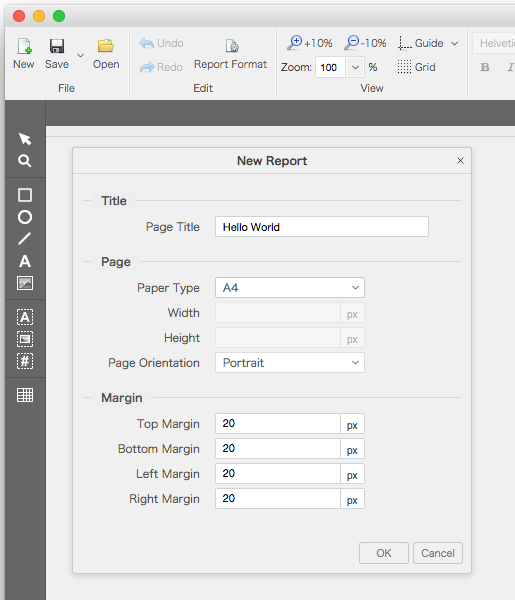

Here, we will set the following properties for the new report.

| Property | Value |
| --- | --- |
| Page Title | Hello World (you can also leave it blank) |
| Paper Type | A4 |

Once you click OK, a new tab will be shown above the canvas.
We will now go through the procedures to create the example below.

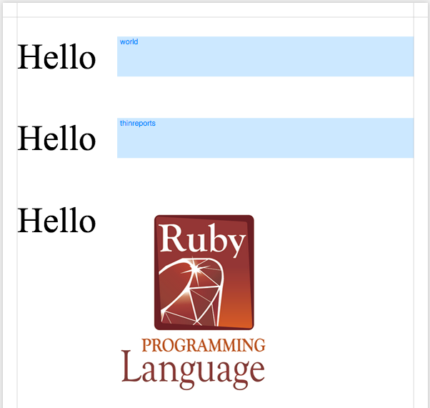

#### Using the Text tool

First, select the Text tool Text tool from the toolbox on the left side of the Editor. With this tool selected, click on the canvas and drag to create the text box. A dialog box for entering the text will appear. Enter the word "Hello" for the content, and press OK.

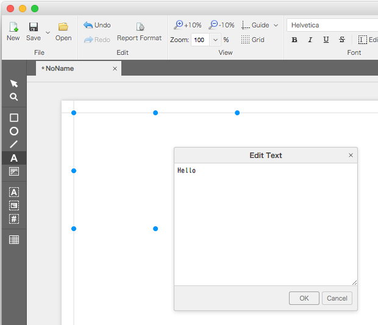

While the "Hello" text box is still selected, we can change the style of the text. From the toolbar at the top of the editor, change the font to "Times New Roman", and the font size to "50".

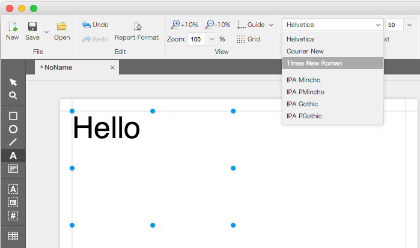

#### Using the Block tool

Next, we will use the Bock Tool to create the "World" part.

With the Block tool selected, drag on the canvas to create a block next to "Hello".

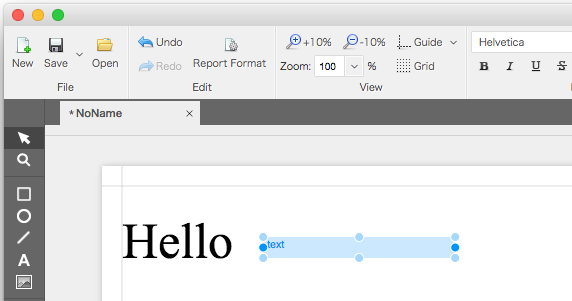

We will now style the block to be the same format as the “Hello” textbox, but using a different method. The properties of the selected object (text, block, or any other element) will be shown on the right side of the editor (Property), and can be edited directly from here.

After creating the block, it will be selected, and its properties will be shown on the right. From here, change the font "Family" property to "Times New Roman" and the "Size" property to "50".

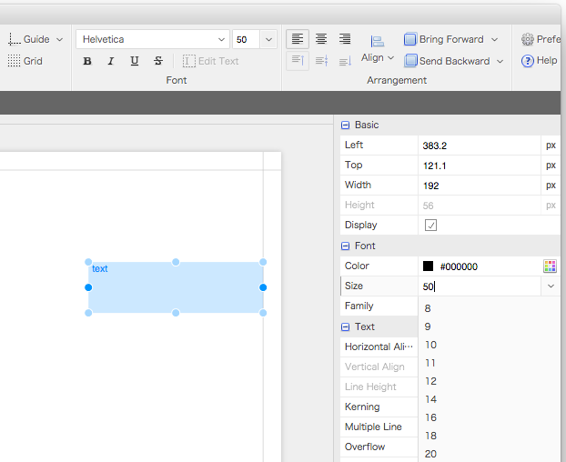

Next, we will set the ID of the block. The default ID is set as `text`, and we will change this to `world`.

Similar to the previous step, we will change the ID from the Property pane. In the Property pane, find the "ID" field under "Association",
and change its value from `text` to `world`. Once this is changed, the text in the block will also change to `world`.

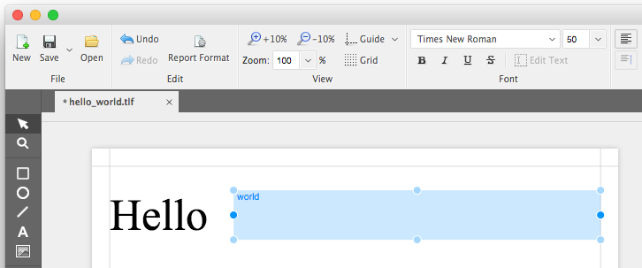

We have finished setting the properties for our `Hello` and `world` elements, and will now insert additional `Hello` and `world` elements into our document.

#### Copy and Paste functions on multiple selection

First, select the Selection tool Selection tool from the toolbox. Next, drag a box around both the `Hello` and `World` elements to select both items at once. Furthermore, you can also select additional elements by `Ctrl (Command) + Click` on the element.

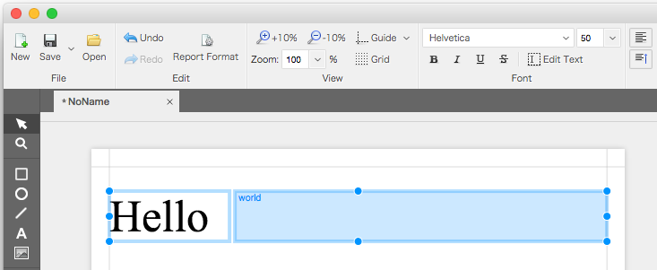

Press `Ctrl(Command) + C (copy)` to copy the selected elements, and press `Ctrl(Command) + V (paste)` to paste them onto the canvas. An identical copy of `Hello` and `World` will be created at the same position as the original, and will be selected by default. As they are stacked on top of each other, the new elements may be a little difficult to distinguish from the old one.

Using the arrow keys, move the selected elements to the position shown in the example below.

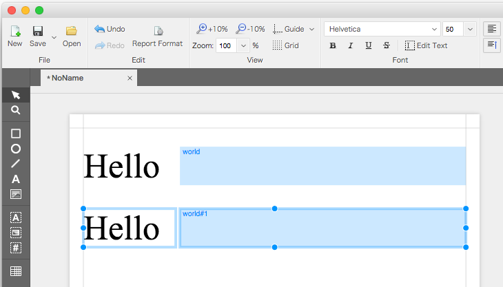

Now, we will set the properties for the copied block element.

First, click on a blank area on the cavas to deselect all elements.
Next, select the copied block element and change the ID from `world#1` to `thinreports`.

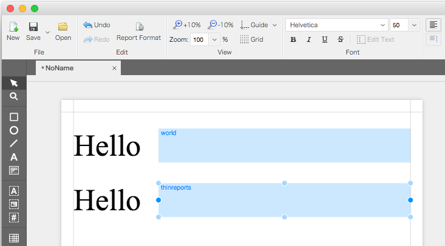

#### ID properties of other elements

In addition, you can also set the ID property of elements that are not blocks. Select the first `Hello` and change the ID property to hello.
With the ID set, you can use the Generator to change the display properties of the element programmatically.

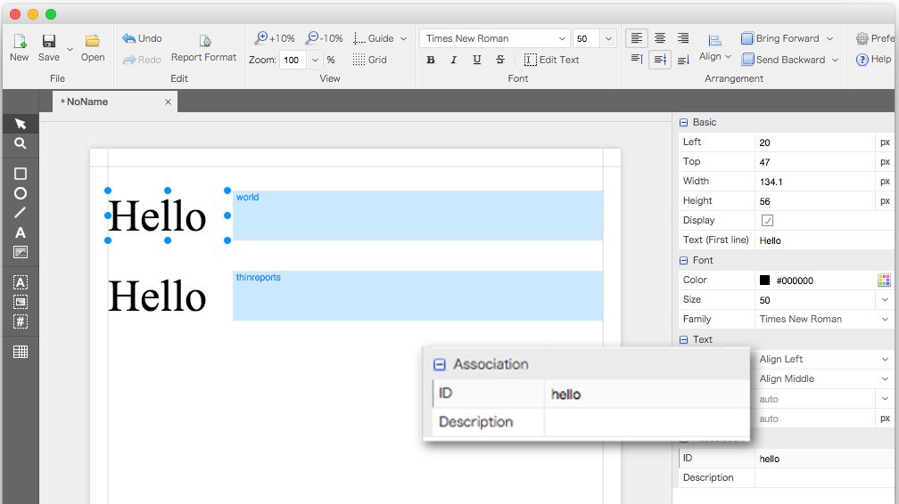

#### Using the Image tool

Next, we will use the Image tool to embed an image into the layout.

First, select the first `Hello`, copy and paste the element, and move the element to the third row of the document.
Then select the Image tool and click on the canvas to create an image box.

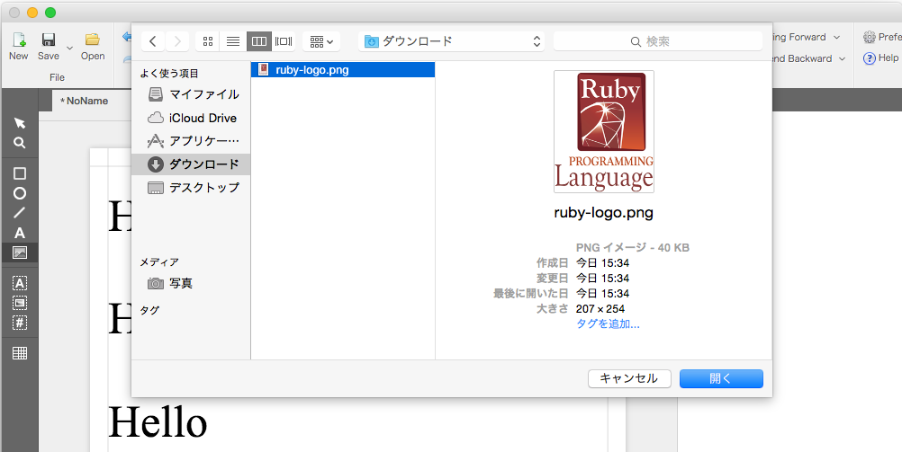

From the dialog box, select an image file. Rearrange the image to be at a similar size and position as the example below.

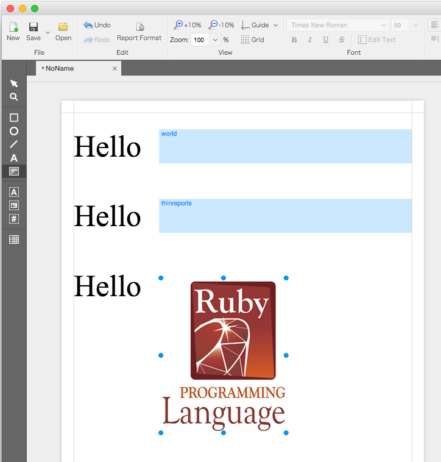

We have now finished creating our first layout.
Click save on the toolbar to save the file (Here, the file was saved to `/Users/<user>/Documents/hello_world.tlf`).


### Step2 Creating the report generation script

Next, we will write a Ruby script to generate a report from the layout created in Step1. Save the code below to your system. Here, the file was saved in the same location as the layout (in this case, `/Users/<user>/Documents/hello_world.rb`).

```ruby
require 'thinreports'

report = Thinreports::Report.new layout: 'hello_world'

# 1st page
report.start_new_page

report.page.item(:world).value('Thinreports')
report.page.item(:thinreports).value('Thinreports')

# 2nd page
report.start_new_page do |page|
  page.item(:world).value('Ruby').style(:color, '#ff0000')
  page.item(:hello).style(:color, '#ff0000')
  page.item(:thinreports).value('Thinreports')
end

# 3rd page
report.start_new_page do
  item(:world).value('Hello')
  item(:hello).hide
end

# 4th page
report.start_new_page do
  values(world: 'World',
         thinreports: 'Thinreports')
end

report.generate(filename: 'hello_world.pdf')

puts 'Done!'
```

The code above will now be explained.

```ruby
require 'thinreports'
```

This is code for loading thinreports.

```ruby
report = Thinreports::Report.new layout: 'hello_world'
```

The layout is loaded, and a `Thinreports::Report` object is instantiated. When defining the layout, the extension `*.tlf` can be ommitted. In addition, the report can also be generated using the alternative methods below.

```ruby
# #create method without arguments
report = Thinreports::Report.create(layout: 'hello_world.tlf') do
  start_new_page
  # :
end

# #create method with arguments
report = Thinreports::Report.create(layout: 'hello_world') do |r|
  r.start_new_page
  # :
end

# #generate method (direct usage)
#
# Data for the PDF file is returned from this method, and can be written to file or
# used as part of an HTTP response once the proper MIME-Type is set.
output = Thinreports::Report.generate(layout: 'hello_world') do
  start_new_page
  # :
end

# #use_layout method to set layout
report = Thinreports::Report.new
report.use_layout 'hello_world.tlf'

Thinreports::Report.generate do
  use_layout 'hello_world'
end
```

```ruby
# 1st page
report.start_new_page

report.page.item(:world).value('Thinreports')
report.page.item(:thinreports).value('Thinreports')
```

This show you how to create a new page, and how to use the `report.page` directive to refer to the newly created page.

```ruby
# 2nd page
report.start_new_page do |page|
  page.item(:world).value('Ruby').style(:color, '#ff0000')
  page.item(:hello).style(:color, '#ff0000')
  page.item(:thinreports).value('Thinreports')
end
```

This shows you how to create a new page and assign the variables directly inside the block. Here, the page variable refers to the new page. We can also see the `#style()` method chain being invoked to dynamically change the color of the text (The `:color` argument refers to the text color of the element).

```ruby
# 3rd page
report.start_new_page do
  item(:world).value('Hello')
  item(:hello).hide
end
```

This also shows a new page being added through a block, but the page reference inside the block have been ommitted. Without the argument, the block is scoped to `report.page`, thus the `#item()` method can be called. In addition, the `#hide()` method was called on the `:hello` object to set the object as hidden.

```ruby
# 4th page
report.start_new_page do
  values(world: 'World',
         thinreports: 'Thinreports')
end
```

This uses the same argument-less block method as `#start_new_page do ... end`, but all the variables were set through the `#values()` method.  The `#values()` method receives the multiple arguments in `id: value` form, allowing multiple variables to be set in a single call.

```ruby
report.generate(filename: 'hello_world.pdf')
```

This takes all the settings so far to generate a PDF file called `hello_world.pdf`. If the `#generate()` method was used without `:filename` property, the PDF data is generated without creating a file on disk.

### Step3 Creating the report

We will now create the report file in PDF format. Open console and enter the commands below.

```
$ cd ~/Documents
$ ruby hello_world.rb
Done!
```

If the console displays "Done!", the report was created successfully.  The report file will be located in the same folder as the generator script, and will be named `hello_world.pdf`.

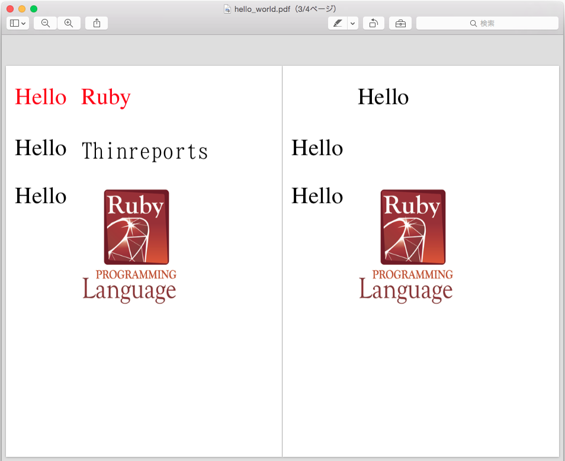
