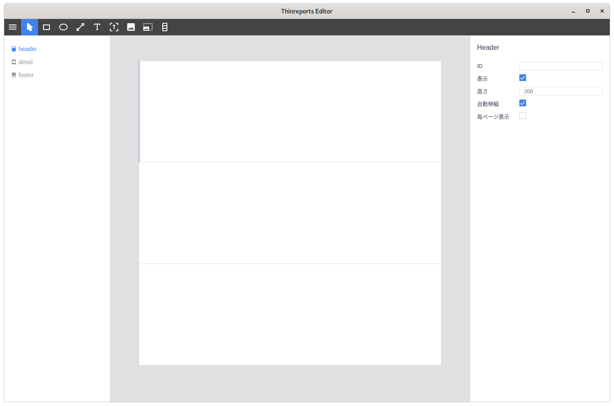
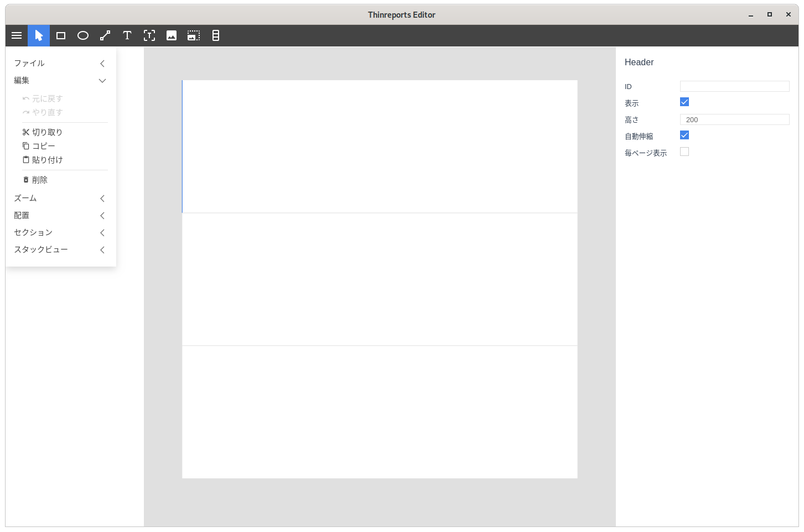
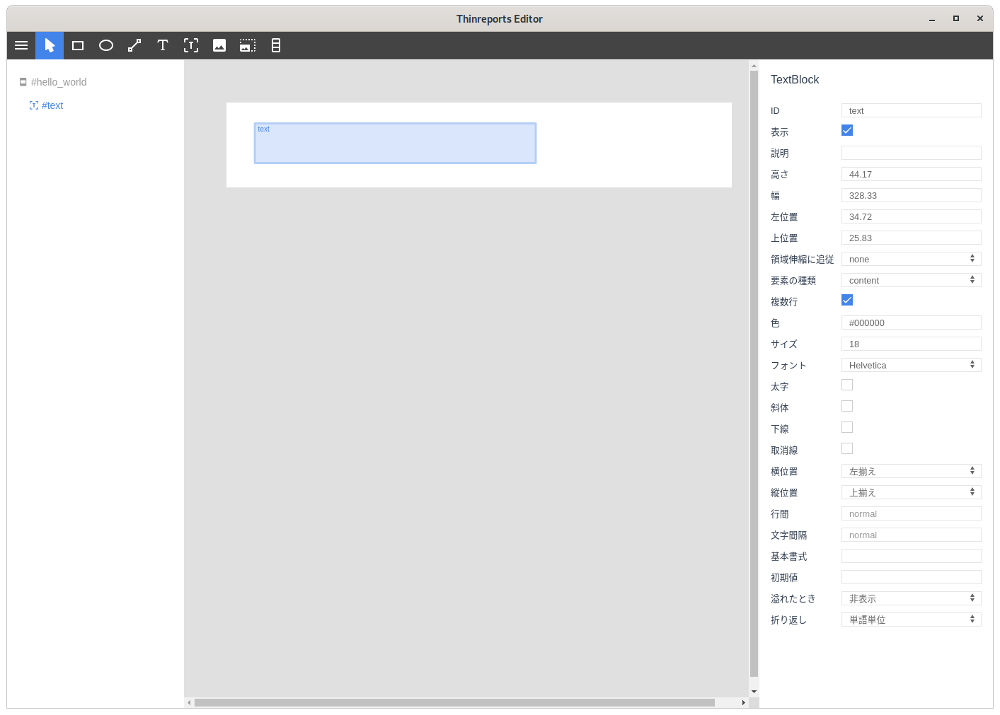
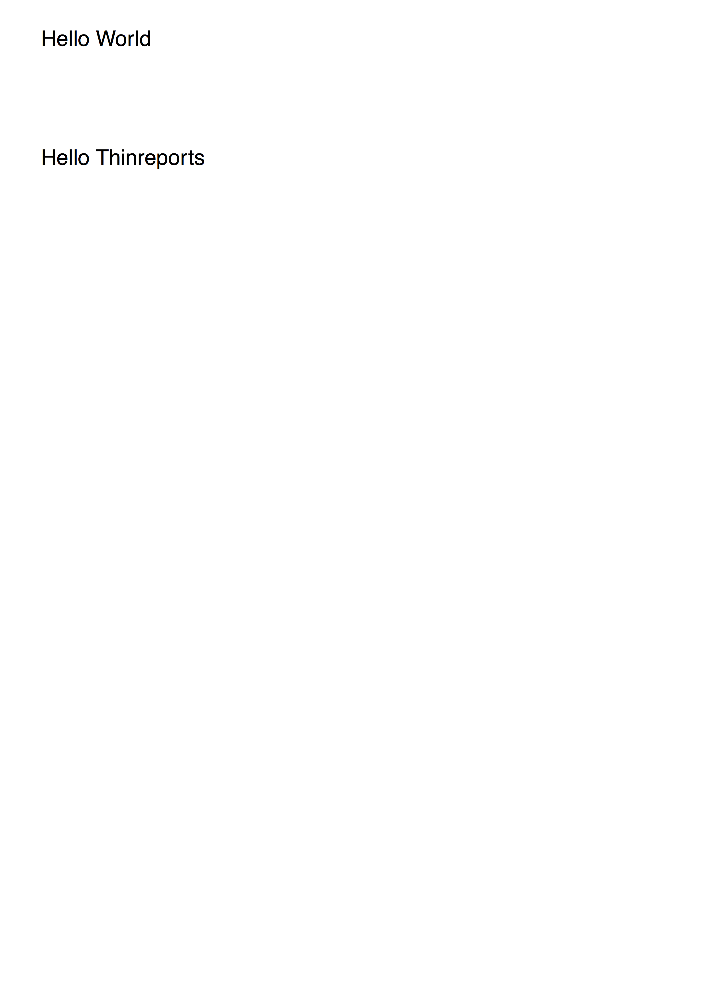

# Section Format

*Currently under development*

Section Format is a new template format that allows you to define a layout by dividing it into units called sections, and then freely combine them to generate a PDF.

## Features

- Divides layouts into units called Section and allows them to be freely combined
- Section types support header, footer, and detail, and any number of each can be defined
- Newly added StackView allows you to create layouts with multiple rows stacked vertically within a section
- Section and StackView can automatically expand and contract their own height according to the content after drawing by enabling auto-stretch

See [Examples](#examples) for further explanation and details.

## Prerequisites

To generate a PDF using a template file (`.tlf`) formatted Section Format, you will need the following tools.

### Section Editor

[Section Editor](https://github.com/thinreports/thinreports-section-editor) is a design tool for creating/editing a template file formatted Section Format.

### Generator

[Generator](https://github.com/thinreports/thinreports-generator) is a Ruby library to generate PDFs.

## Installation

### Section Editor

Please follow [the installation instructions in the thinreports-section-editor](https://github.com/thinreports/thinreports-section-editor#installation).

### Generator

Please follow [the installation instructions in the thinreports-generator](https://github.com/thinreports/thinreports-generator#installation).

## Quick Start

First, create a template.

Launch the editor applicaiton.




Delete the header and footer sections, which are unnecessary in this example.
Click the section region to select, and click *削除 (Delete)* in the *編集 (Edit)* menu.




Specify the properties of the *detail* section.
Click the *detail* section region. In the right property pane, input `hello_world` as the *ID* attribute. And enter `100` as the *高さ (height)* attribute.


Put a text-block on the *detail* section.
Select the text-block tool (the red circle in the figure) in the toolbar. And drag and drop in the *detail* section to create a text-block at the region. You can leave the text-block properties as the default values.


The template is now complete.

</Details>

This is a simple template which has a detail section whose ID is `hello_world`. The detail section includes a text-block whose ID is `text`.




Create a dirctory named `hello_world` in an arbitrary location, and save the template as `template.tlf` in the `hello_world` directory.

Then, create `generate.rb` in the `hello_world` directory, and write the following code:

```ruby
require 'thinreports'

report_params = {
  type: :section,
  layout_file: 'template.tlf',
  params: {
    groups: [
      {
        details: [
          {
            id: 'hello_world',
            items: {
              text: 'Hello World'
            }
          },
          {
            id: 'hello_world',
            items: {
              text: 'Hello Thinreports'
            }
          }
        ]
      }
    ]
  }
}

Thinreports.generate(report_params, filename: 'hello.pdf')
```

Execute this, and `hello.pdf` is generated in the `hello_world`  directory.

    $ cd /path/to/hello_world
    $ ruby generate.rb

hello.pdf:


## Examples

Each example includes a description of the specifications, a Ruby code, a template file, and an output PDF file.

- [Basic Usage](https://github.com/thinreports/thinreports-generator/tree/master/test/features/section_report_basic/README.md): a concept and basic usages of the section report format
- [Multiple Groups](https://github.com/thinreports/thinreports-generator/tree/master/test/features/section_report_multiple_groups/README.md): specifications of a `groups` parameter
- [Section Auto Stretch](https://github.com/thinreports/thinreports-generator/tree/master/test/features/section_report_section_auto_stretch/README.md): auto strech specifications of sections
- [Section Bottom Margin](https://github.com/thinreports/thinreports-generator/tree/master/test/features/section_report_section_bottom_margin/README.md): bottom margin specifications of sections
- [Section Parameters](https://github.com/thinreports/thinreports-generator/tree/master/test/features/section_report_section_parameters/README.md): parameter specifications of sections
- [Item Follow Stretch](https://github.com/thinreports/thinreports-generator/tree/master/test/features/section_report_item_follow_stretch/README.md): specifications of how the containing item is stretched by sections or stack-view-rows
- [Item Parameters](https://github.com/thinreports/thinreports-generator/tree/master/test/features/section_report_item_parameters/README.md): parameter specifications of items (rectangles etc.)
- [StackView](https://github.com/thinreports/thinreports-generator/tree/master/test/features/section_report_stack_view/README.md): specifications of the stack-view tool, which we added independently
- [StackViewRow Auto Stretch](https://github.com/thinreports/thinreports-generator/tree/master/test/features/section_report_stack_view_row_auto_stretch/README.md): auto stretch specifications of stack-view-rows (same as sections)
- [StackViewRow Bottom Margin](https://github.com/thinreports/thinreports-generator/tree/master/test/features/section_report_stack_view_row_bottom_margin/README.md): bottom margin specifications of stack-view-rows (same as sections)
- [StackViewRow Parameters](https://github.com/thinreports/thinreports-generator/tree/master/test/features/section_report_stack_view_row_parameters/README.md): parameter specifications of stack-view-rows
- [StackView with Floating Item](https://github.com/thinreports/thinreports-generator/tree/master/test/features/section_report_stack_view_with_floating_item/README.md): how to place items outside of stack-view-rows and its specifications
- [Nonexistent Id](https://github.com/thinreports/thinreports-generator/tree/master/test/features/section_report_nonexistent_id/README.md): specifications when a non-existent section or item is specified as a parameter
- [TextBlock Vertical Align](https://github.com/thinreports/thinreports-generator/tree/master/test/features/section_report_text_block_vertical_align/README.md): vertical alignment specifications when a text-block has a `overflow: expand` attribute

## Related Issues and pull requests

- [Issue: New Report Type: Section Report (Official proposal)](https://github.com/thinreports/thinreports/issues/7)
- [Issue: Implement "New Report Type: Section Report"](https://github.com/thinreports/thinreports/issues/12)
- [Pull request: Add a new editor for the sectoin-report format](https://github.com/thinreports/thinreports-basic-editor/pull/87)
